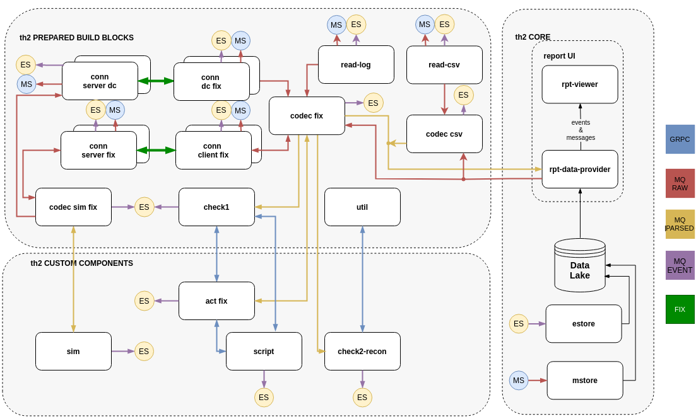

## Version (this version is under development) ##

This version based on infra 1.5.3

Components versions are updated. 
Please note that messages from act-fix to conn now pass through codec-fix encoder.

### Scenario execution:
For the proper scenario execution, it is necessary to start some boxes outside the cluster: 

A **simulator** that simulates the operation of a remote test system and is capable of producing an outputs in the form of the fix protocol and in the form of files. 

And two read boxes - **read-log** and **read-csv**, which read the files produced by the emulator of the test system and send the data to the th2 system.

### Execution steps:
ℹ️  **Instructions to launch applications outside the cluster(ExternalBox functionality):** https://github.com/th2-net/th2-documentation/wiki/Connecting-external-box-to-cluster-using-kubectl
1. **Create new namespace using CRs from this branch** (please find general information about namespace creation below).
2. **Launch the simulator - test system emulator producing FIX responses and file output** (default output path is folder **demo_outputs** in user home folder).

    **Simulator**: https://github.com/th2-net/th2-sim-template/tree/demo-ver-1.5.3-local
3. **Launch the test script.**

    **Test script**: https://github.com/th2-net/th2-demo-script/tree/ver-1.5.3-main_scenario
4. **Launch both reads to process file outputs** (default output path is folder **demo_outputs** in user home folder).

    **Read-log:** https://github.com/th2-net/th2-read-log/tree/demo-ver-1.5.3-local

    **Read-csv:** https://github.com/th2-net/th2-read-csv/tree/demo-ver-1.5.3-local

### Work in progress:
We want to provide you with a convenient example of the operation of our components for reading logs and csv-files, as well as reconciliation of data obtained from these sources. At the moment, we are looking for a convenient way to work with files on this test bench.

## Environment schema

# General information about configuring Schema #

Schema can be configured to be deployed to kubernetes and managed by infra manager.
Behaviour is controlled by `k8s-propagation` property in the `infra-mgr-config.yml` file.
These are the possible values for this property:

- `off`  - No synchronization will be done
- `deny` - No synchronization will be done and associated namespace will be removed from the kubernetes
- `sync` - Synchronizes repository changes with kubernetes
- `rule` - Synchronizes repository changes with kubernetes. Also monitors resource changes in kubernetes and 
         brings them back to repository state
  
## Creating new namespace
1) Create a new branch based on master
2) Make all the wanted changes in the `CRs`.
3) If you want to add new component make sure to include it in `links-live.yml`, `dictionary-links.yml`, `codec-links.yml` (if needed) link files are placed in `links` directory.
4) If you are going to have several namespaces together, make sure to assign each component in each namespace with unique `nodePort`. (nodePorts must be unique across the namespaces too)components that require `nodePort` are: `rpt-data-provider`, `rpt-data-viewer`, `act`, `check1`. Following ports are reserved by th2-infra: `rmq ampq protocol: 32000`, `cassandra cql: 32010`, `ingress: 30000`.
5) Make sure that `k8s-propagation` property in `infra-mgr-config.yml` file is set to `sync` (only branches that have this property set to `sync` or `rule` will be deployed by infra manager).
6) commit all new branch to `git`. (After committing new namespace will be created automatically, it might take 20-40 seconds)

## Restarting existing namespace
There are two methods to restart the namespace

**Repository only method**
1) set `k8s-propagation` property to `deny` in `infra-mgr-config.yml`. Namespace will be deleted by infra manager during 30-60 secs.
2) set `k8s-propagation` property to `sync` or `rule` in `infra-mgr-config.yml`. Schema will be deployed by infra manager during 30-60 secs.

**Involving kubernetes**
1) set `k8s-propagation` property in `infra-mgr-config.yml` to `rule` and commit this change.
2) delete an existing namespace using `kubectl delete namespace NAMESPACE_NAME` command. Schema will be redeployed automatically after 30-60 secs

## Restarting single component
in order to restart single component just delete `pod` of that specific component using `kubectl delete pod POD_NAME -n POD_NAMESPACE` command or using kubernetes dashboard (if you have necessary privileges). After deleting, `pod` will be recreated automatically.  

